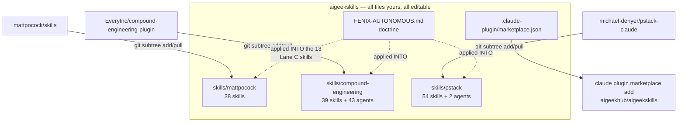

# feat: aigeekskills — one consolidated skills repo for the FENIX SHIP LOOP

**Target repo:** `aigeekskills` (new). This plan lives in painpointr-beta but builds a separate repo.
All paths below are relative to the new repo's root unless stated otherwise.

---

## Summary

Build one repo under your account that carries every skill the FENIX SHIP LOOP uses, rewritten for
unattended operation, installable with a single `claude plugin marketplace add`. The research phase
overturned the obvious approach: the thirteen Lane C skills cannot be extracted from their packs,
because they depend on roughly thirty sibling agents and skills that do the actual work. The plan
therefore imports all three packs whole into one repo you own, then edits the autonomous doctrine
directly into the thirteen.

---

## Problem Frame

Three skill packs currently reach this machine three different ways: Matt Pocock as loose symlinks
from an untracked directory, Compound Engineering as loose untracked directories, pstack as a proper
plugin. None of the first two are under version control, so customizations are invisible, unbacked
up, and silently destroyed by the next reinstall. Nothing ties the three to the FENIX SHIP LOOP, and
nothing makes them safe to run unattended.

The goal is one git-controlled source of truth, installable on any machine, that encodes the loop's
conventions and survives an overnight run without a human answering questions.

---

## Requirements

- **R1** One repo, `aigeekskills`, under `aigeekhub`, holding every skill the loop invokes.
- **R2** Installable into Claude Code without manual file copying.
- **R3** The thirteen Lane C skills honor the FENIX autonomous doctrine: never block, prefer the
  reversible branch, require real-app proof, still stop on irreversible actions.
- **R4** Upstream attribution and licensing preserved per pack.
- **R5** A repeatable way to pull upstream improvements later without hand-merging.
- **R6** Name collisions on `tdd` and `teach` resolved deterministically.
- **R7** **Closure completeness.** Every component any shipped skill references must also ship in this
  repo. No skill may depend on something installed elsewhere on the machine. This explicitly includes
  all 30+ components the thirteen Lane C skills reach for — CE's review-persona agents
  (`ce-correctness-reviewer`, `ce-security-reviewer`, `ce-adversarial-reviewer`, and the rest), its
  researcher agents (`ce-repo-research-analyst`, `ce-learnings-researcher`, `ce-web-researcher`,
  `ce-framework-docs-researcher`, `ce-best-practices-researcher`, `ce-spec-flow-analyzer`), and every
  sibling skill they call (`ce-doc-review`, `ce-brainstorm`, `ce-debug`, `ce-commit`, `ce-proof`).
  Verified mechanically by U5, which fails the build on any dangling reference.

---

## Key Technical Decisions

### KTD1 — Import whole packs, do not extract thirteen skills

Research finding that drove this: the thirteen target skills reference **30+ components outside the
set**, and the important ones are agents, not skills. `ce-code-review` spawns `ce-correctness-reviewer`,
`ce-maintainability-reviewer`, `ce-security-reviewer`, `ce-adversarial-reviewer` and a dozen more
persona agents. `ce-plan` dispatches six researcher agents. Extract the skill without the agents and
you get a shell that announces a review and performs none.

The transitive closure is close to the whole pack anyway: CE ships 43 agents and 39 skills, pstack 54
skills, Matt 38 skills. Cherry-picking buys nothing and costs correctness.

**Decision:** import all three packs whole, as subdirectories of one repo you own. Edit the thirteen
Lane C skills in place per KTD3; the rest arrive as-is and stay editable.

**This is what satisfies R7.** Importing whole is a superset of the closure: the 30+ referenced
components all ship, along with everything else the packs carry — 131 skills and 45 agents in total.
Nothing the loop touches resolves to a file outside this repo. The alternative, tracing the closure
and copying only what it names, is both more work and more fragile: every upstream pull could add
a reference that the trace missed, and the failure mode is a skill that silently does nothing.

### KTD2 — Ship as a multi-plugin marketplace

All three upstreams already ship `.claude-plugin/marketplace.json`. Claude Code's marketplace format
supports multiple plugins per repo, so `aigeekskills` exposes the three imported packs as plugins
under your own marketplace name, authored to FENIX DIGITAL ENTERPRISE LLC.

Satisfies R2 with one command, gives versioning, and matches how pstack already installs on this
machine. Rejected alternative: loose skill directories, which is what created the untracked mess this
plan exists to fix.

### KTD3 — The skills are yours and are edited in place

**Revised 2026-09-17 on Mista Boo's direction.** The earlier version of this decision kept upstream
files byte-identical and layered thin wrapper skills beside them. That was rejected, correctly.

A wrapper can only bolt instructions onto the front or back of someone else's skill. It cannot fix a
bad line inside one, and it forces a reader to hold two files in their head to understand one
behavior. The stated goal was skills rewritten to fit this workflow. Wrappers are an imitation of
that.

**Decision:** imported skills live at `skills/` as first-class, editable files under the
`aigeekskills` name, authored to FENIX DIGITAL ENTERPRISE LLC. Edit them directly. The autonomous
doctrine is applied *into* each of the thirteen Lane C skills, not wrapped around them.

The cost is real and stated plainly: editing a file means a future upstream change to that same file
can conflict. KTD5 keeps that cost small and survivable rather than pretending it away.

### KTD4 — Collisions resolved by namespace, not deletion

`tdd` and `teach` exist in both Matt's pack and pstack's with genuinely different scopes. Matt's
`tdd` is for building features test-first; pstack's is narrow, for regression tests on known bugs.
Both earn their place. Plugin namespacing keeps them addressable as distinct commands, matching the
rule already written into painpointr-beta's CLAUDE.md.

### KTD5 — Import with `git subtree`, so edits and upstream merges coexist

**Revised 2026-09-17.** Since KTD3 now edits files in place, a wholesale-replace refresh would
destroy those edits. The mechanism has to support both ownership and updates.

`git subtree` does exactly this. It imports an upstream repo into a subdirectory of yours as real
committed files you own and can edit freely. Later, `git subtree pull --prefix=skills/<pack>` merges
new upstream work into that subdirectory using git's normal merge machinery.

What this buys, concretely:

- Files are yours. Editable, committed under your name, no frozen-snapshot rule.
- Upstream improvements remain reachable rather than permanently forfeited.
- Conflicts appear **only in files you personally edited**. You are editing 13 skills out of 131, so
  roughly 90% of the tree merges silently forever.
- No submodules. No detached pointers, no second clone step, no broken checkouts.

Verified available: `git subtree`, git 2.55.0 on this machine.

Rejected alternative, the previous version of this decision: replace-the-folder refresh. Painless to
sync, but it forbids editing, which is the thing actually being asked for.

---

## High-Level Technical Design



Upstream flows in through subtree merges. The doctrine is edited into the thirteen Lane C skills
directly rather than wrapped around them. Merge conflicts on a later pull are confined to those
thirteen files; the other ~118 skills and 45 agents merge silently.

---

## Output Structure

```
aigeekskills/
  .claude-plugin/marketplace.json   (plugin name: aigeekskills, author: FENIX DIGITAL)
  FENIX-AUTONOMOUS.md               (doctrine, edited INTO the 13 below)
  README.md
  LICENSE                           (yours)
  NOTICE.md                         (upstream MIT attributions, all three)
  skills/
    mattpocock/            38 skills   <- git subtree, editable
    compound-engineering/  39 skills + 43 agents
    pstack/                54 skills + 2 agents
  scripts/
    sync-upstream.sh       wraps git subtree pull per pack
    verify-closure.sh      fails on any dangling reference (R7)
```

No `vendor/` and no wrapper plugin. Everything under `skills/` is yours to edit.

---

## Implementation Units

### U1. Scaffold the repo and marketplace manifest

**Goal:** An empty but installable `aigeekskills`.
**Requirements:** R1, R2
**Dependencies:** none
**Files:** `.claude-plugin/marketplace.json`, `README.md`, `LICENSE`
**Approach:** Mirror the manifest shape already used by CE's marketplace.json. Declare the three pack plugins up
front, pointing at the `skills/` paths populated in U2.
**Patterns to follow:** `compound-engineering-plugin/.claude-plugin/marketplace.json`
**Test scenarios:**
- `claude plugin marketplace add` against the local path succeeds and lists the declared plugins.
- The manifest names `aigeekskills` as owner, not any upstream author.
- Malformed JSON is rejected by `claude plugin validate` with a nonzero exit.
**Verification:** `claude plugin validate` passes and the marketplace resolves under your name.

### U2. Import the three packs with `git subtree`

**Goal:** All three packs present as editable files you own, each with a working upstream merge path.
**Requirements:** R1, R4, R5
**Dependencies:** U1
**Files:** `skills/mattpocock/`, `skills/compound-engineering/`, `skills/pstack/`, `NOTICE.md`
**Approach:** Register each upstream as a git remote, then `git subtree add --prefix=skills/<pack>
<remote> main --squash`. Squash keeps your history readable; the subtree metadata still records the
imported ref so later pulls know their base. Import complete packs, including each pack's own LICENSE
and NOTICE files, then collect all three attributions into a root `NOTICE.md`.
**Patterns to follow:** pstack already vendors third-party attributions in `poteto-mode/licenses/`;
mirror that discipline at the root.
**Test scenarios:**
- Every path listed by `git ls-files` in each upstream exists under the matching `skills/` prefix.
- pstack's `NOTICE.md`, `NOTICE-skills.md`, and `LICENSE-cursor-team-kit` survive the import.
- `poteto-mode` arrives complete: 58 files across 7 subdirectories including `licenses/`.
- Editing an imported file, committing, then running `git subtree pull` on an unchanged upstream
  leaves the edit intact.
- Root `NOTICE.md` names all three upstreams with their MIT terms.
**Verification:** File counts match the upstreams (169 / 566 / 216), and a no-op `git subtree pull`
succeeds against each pack.

### U3. Port the autonomous doctrine and the decision trail

**Goal:** The doctrine every override honors, plus the audit surface it writes to.
**Requirements:** R3
**Dependencies:** U1
**Files:** `FENIX-AUTONOMOUS.md`, `scripts/trail.sh`
**Approach:** The doctrine is already drafted and carries activation signals, the four rules, the
decision-trail format, and honest limits. Port it to the repo root and add the trail-writing helper
that the edited skills call.
**Test scenarios:**
- The activation check returns false in a repo with no config and no env var.
- Setting `autonomous: on` in a repo's `.compound-engineering/config.yaml` flips it true.
- `FENIX_AUTONOMOUS=1` flips it true with no config file present.
- A trail row written for a non-reversible decision includes `reversible=no`.
**Verification:** Activation logic behaves correctly across all four signals from the doctrine table.

### U4. Edit the doctrine into the thirteen Lane C skills

**Goal:** The thirteen skills themselves honor the autonomous doctrine. No wrappers.
**Requirements:** R3, R6
**Dependencies:** U2, U3
**Files:** the `SKILL.md` of each of `skills/mattpocock/skills/engineering/{grill-with-docs,tdd}`,
`skills/compound-engineering/plugins/compound-engineering/skills/ce-{plan,work,simplify-code,code-review,commit-push-pr,compound}`,
`skills/pstack/plugins/pstack/skills/{poteto-mode,interrogate,blast-radius,create-verification-skill,babysit}`
**Approach:** Insert an `## Autonomous mode` section after each skill's frontmatter and rewrite that
skill's specific blocking points in place. Research located 34 such points. Three cases differ:
`ce-plan` and `ce-compound` already carry headless machinery, so the edit forces the existing path
rather than adding behavior. `poteto-mode` already argues against blocking and already routes
unattended work to a decision trail, so the edit extends what is there.

Keep each edit small and additive. Every line changed is a line that can conflict on a future
`git subtree pull`, so minimal diffs are a maintenance decision, not a style preference.
**Execution note:** Start with `ce-code-review`, whose 43-agent dependency is the riskiest assumption
in the plan. If its persona agents do not resolve from the imported path, the architecture is wrong
and it is better to learn that in U4 than in U7.
**Test scenarios:**
- Each of the 13 still resolves as a command after install.
- `ce-code-review` spawns its persona agents from the imported path, not a global install.
- With autonomous off, each skill behaves as upstream wrote it.
- With autonomous on, a skill that would have asked a question writes a trail row and proceeds.
- A skill asked to force-push stops and reports, in both modes.
- `/tdd` and `/pstack:tdd` remain distinct and separately addressable.
- `git diff` against the imported base shows edits confined to the 13 files.
**Verification:** All 13 resolve; autonomous-on and autonomous-off differ only at documented points;
no file outside the 13 is modified.

### U5. Closure verification script

**Goal:** Prove no skill references something the repo does not ship. This is R7's enforcement.
**Requirements:** R1, R7
**Dependencies:** U2, U4
**Files:** `scripts/verify-closure.sh`
**Approach:** Walk every skill and agent in `skills/`, extract referenced skill and agent names, and
fail on any name the repo cannot resolve. This is the check that would have caught the extraction
trap before it cost a day.
**Test scenarios:**
- A clean repo passes with exit 0.
- Deleting one agent directory makes it fail and name that agent.
- A reference to a Claude Code builtin is not reported as dangling.
**Verification:** Exit 0 on the built repo; nonzero with a named culprit when a dependency is removed.

### U6. Upstream sync script

**Goal:** Pull upstream improvements into a pack, surfacing conflicts only where you edited.
**Requirements:** R5
**Dependencies:** U2, U4, U5
**Files:** `scripts/sync-upstream.sh`
**Approach:** Wrap `git subtree pull --prefix=skills/<pack> <remote> main --squash` per pack. Refuse
to run on a dirty tree. On conflict, stop and print exactly which files conflicted, which will be a
subset of the 13 edited in U4. After a clean merge, run closure verification and report the diff.
**Test scenarios:**
- A pull against an unchanged upstream is a no-op.
- A pull on a dirty working tree is refused before anything is merged.
- A pull that changes an unedited file merges with no conflict.
- A pull that changes a file edited in U4 conflicts, and the script names that file rather than
  failing silently.
- A pull that breaks closure is reported by `verify-closure.sh` after the merge.
**Verification:** No-op pull succeeds; a simulated upstream edit to an untouched skill merges
cleanly; a simulated upstream edit to an edited skill conflicts and is named.

### U7. Install, cut over, and document

**Goal:** This machine runs from `aigeekskills`, and the loop's docs point at it.
**Requirements:** R1, R2, R6
**Dependencies:** U4, U5, U6
**Files:** `README.md`, and in painpointr-beta: `CLAUDE.md`, `FENIX_SHIP_LOOP.md`
**Approach:** Install the marketplace, migrate off the untracked loose installs, and update the loop
docs so the collision table and command names match what is actually installed. Remove the three
interim forks only after the consolidated repo is proven.
**Test scenarios:**
- A fresh `claude plugin marketplace add` from the GitHub URL installs every declared plugin.
- After cutover, `/tdd` and `/pstack:tdd` both still resolve to their correct distinct skills.
- The loop's documented Lane C commands all resolve post-cutover.
**Verification:** Every command named in FENIX_SHIP_LOOP.md's Lane C loop resolves after a clean
install on this machine.

---

## Scope Boundaries

**In scope:** the repo, the subtree imports, the 13 in-place skill edits, install and sync machinery, cutover.

### Deferred to Follow-Up Work
- Autonomous-mode edits for skills outside Lane C. The other ~118 ship as imported and fully usable.
- Publishing the marketplace anywhere public or promoting it.
- CI that runs closure verification on push.

### Out of scope
- Changing what the FENIX SHIP LOOP does. This plan changes where its skills live, not the loop.
- Reworking the ~118 non-Lane-C skills. They are yours and editable, but this plan does not touch them.

---

## Risks & Dependencies

| Risk | Impact | Mitigation |
|---|---|---|
| Imported skills resolve agents from the global install, not the imported path | The repo silently exercises the old code and proves nothing | U4 tests this first, on `ce-code-review`, the skill most likely to expose it |
| Editing 13 skills guarantees future merge conflicts | Every upstream pull needs hand-resolution on those files | Keep U4 diffs minimal and additive. 13 of 131 skills are edited, so ~90% of the tree merges silently |
| CE is 25M; the repo gets heavy | Slow clones | Acceptable; measure after U2 and prune only build artifacts, never source |
| Upstream restructures a pack | A pull conflicts broadly, or breaks closure | U6 refuses on a dirty tree and names conflicting files; U5 catches dangling references after the merge |
| `--squash` loses upstream granular history | Harder to bisect an upstream regression | Deliberate. The upstream repos remain available for archaeology; this repo optimizes for readable local history |
| Consolidation was the wrong call | Rework | The three interim forks already exist and stay until U7 proves the consolidated repo |

---

## Open Questions

- Should `aigeekskills` be public or private? Public simplifies `claude plugin marketplace add` and
  honors the upstreams' MIT terms most visibly; private needs auth on every machine that installs it.
  Defaulting to public unless told otherwise, since all three upstreams are MIT and public.
- Whether to keep the three interim forks after cutover. Recommending deletion once U7 passes, but
  that is a destructive outward action and will not happen without your say-so.

---

## Sources & Research

Measured directly from the three cloned forks on 2026-09-17:

- Dependency closure: the 13 target skills reference 30+ components outside the set, chiefly CE's
  review-persona and researcher agents. This finding drove KTD1.
- Pack sizes: Matt 169 files / 3.0M, CE 566 files / 25M, pstack 216 files / 2.5M.
- Component counts: CE 39 skills + 43 agents, pstack 54 skills + 2 agents, Matt 38 skills.
- All three upstreams already ship `.claude-plugin/marketplace.json`, which drove KTD2.
- Skill dependency trees: 107 files across the 13, with `poteto-mode` alone at 58 files and 7
  subdirectories including a vendored `licenses/` folder.
- Blocking points: 34 across the 13, with `ce-plan` and `ce-compound` already carrying headless paths.
